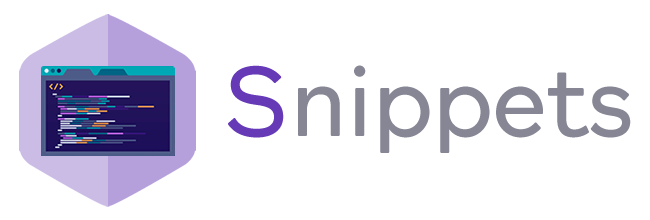

# Descripción

Este repositorio posee **[snippets](https://es.wikipedia.org/wiki/Snippet)** de distintos lenguajes como forma de simplificar la re-utilización de bloques de código, métodos, funciones o simplemente servir como ayuda a memoria en cuanto a la sintaxis especifica de cada lenguaje al momento de hacer alternancia de código (Code-switching).

## Tabla de contenidos

##### Desarrollo

* [**Git**](https://github.com/cpifano/snippets/tree/master/Git)
* [**Python**](https://github.com/cpifano/snippets/tree/master/Python/01%20Introducci%C3%B3n%20Python%203) & [**Django Python**](https://github.com/cpifano/snippets/tree/master/Python/02%20Django)
* [**Rust**](https://github.com/cpifano/snippets/tree/master/Rust)
* [**MEAN Stack**](https://github.com/cpifano/snippets/tree/master/MEAN%20Stack) | `Javascript` `NodeJS` `TypeScript` `Angular` `RxJS`
* [**LAMP Stack**](https://github.com/cpifano/snippets/tree/master/LAMP%20Stack) | `HTML` `CSS` `HTML5` `Javascript` `jQuery` `PHP` | **Deprecado**

##### Sistemas

* [**Docker**](https://github.com/cpifano/snippets/tree/master/Docker)
* [**Kubernetes**](https://github.com/cpifano/snippets/tree/master/Kubernetes)

##### Bases de datos

* [**MongoDB**](https://github.com/cpifano/snippets/tree/master/MongoDB)
